# City Data Visual

**English** · [中文](README.zh-CN.md)

A portfolio of phone-first (`1080×1920`) data visualizations about cities, population, terrain, climate and cultural geography — static stills, pre-rendered animations and 3D scenes, published under **@一尺之棰 / Zeno.yczc**.

> This repository publishes finished images and short metadata only. Rendering code, research notes, parameter contracts, raw data and intermediate outputs stay in the local workspace (see [Repository scope](#repository-scope)).

## Showcase

### City built-space timelines

Annual timelines of when built-up land first appears in twelve Chinese cities, from CMAB v7 / GAIA-derived first-appearance data.

| Beijing | Shanghai | Shenzhen | Changsha | Guangzhou | Nanjing |
|---|---|---|---|---|---|
|  |  |  |  |  |  |

| Hangzhou | Xi'an | Chengdu | Lhasa | Zhengzhou | Shenyang |
|---|---|---|---|---|---|
|  |  |  |  |  |  |

`Age` is a GAIA-derived proxy for when impervious surface first appears, **not** an official building-completion year.

### Population, climate and night light

| China population H3 field | Guangzhou H3 field | Lightning season 2023 | East Asia at night 2024 |
|---|---|---|---|
|  |  | 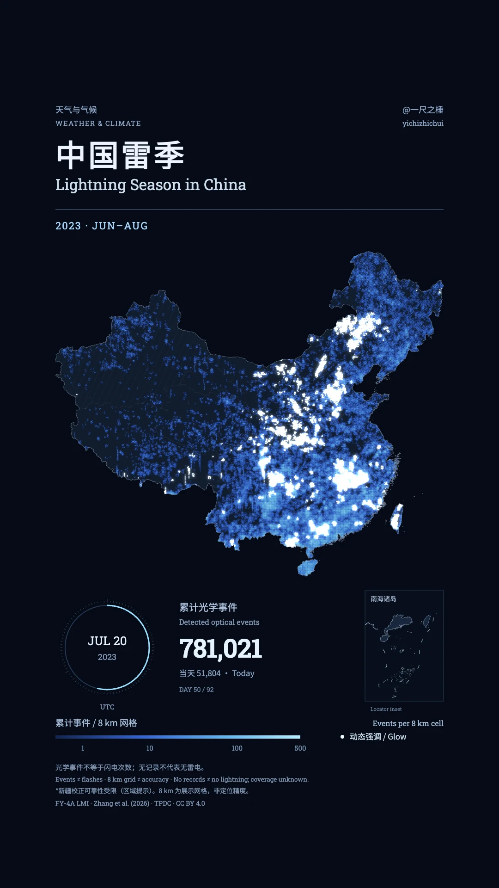 | 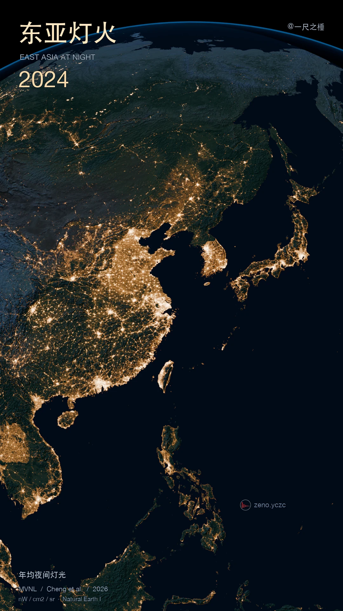 |

### Terrain and hydrology

| Chinese dialect relief | Yangtze hydrology | Yangtze population | Western Taiwan hydrology | Dalian GIS relief | Gyirong port terrain |
|---|---|---|---|---|---|
|  |  |  | 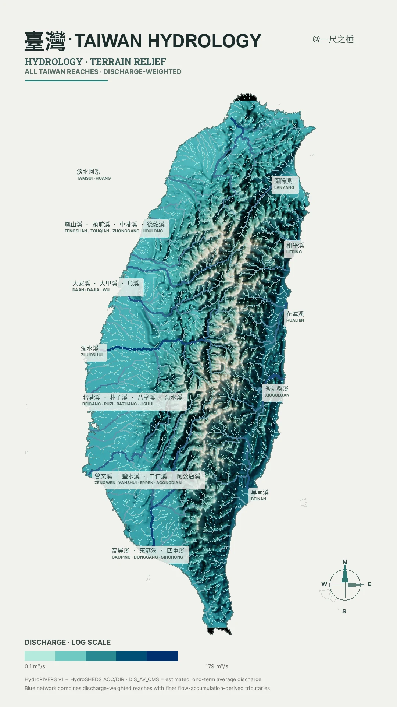 | 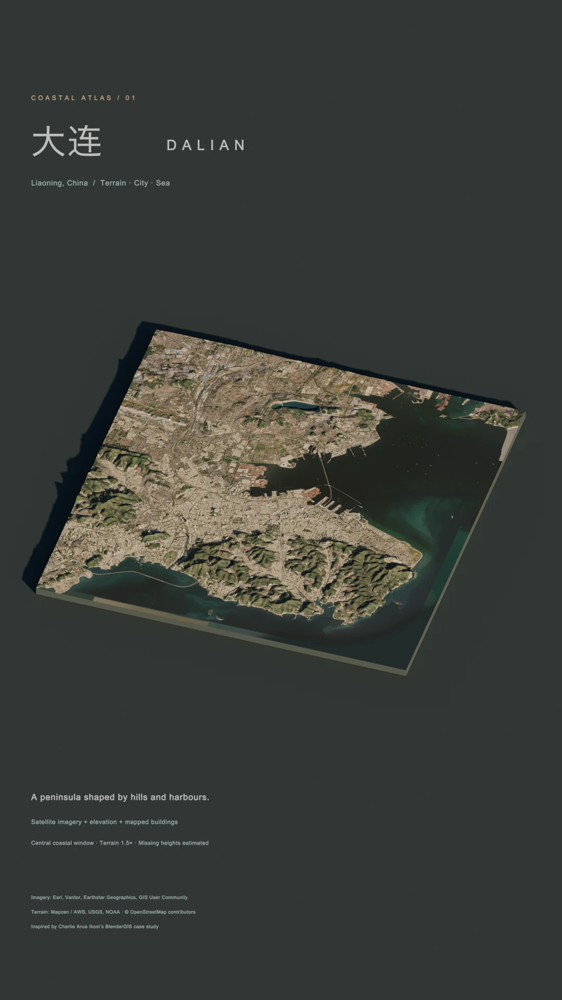 |  |

### Demography and explainers

| Unmarried by age (census) | World births 2023 | Life-expectancy maths | Map projections | English in the world | Names for China |
|---|---|---|---|---|---|
| 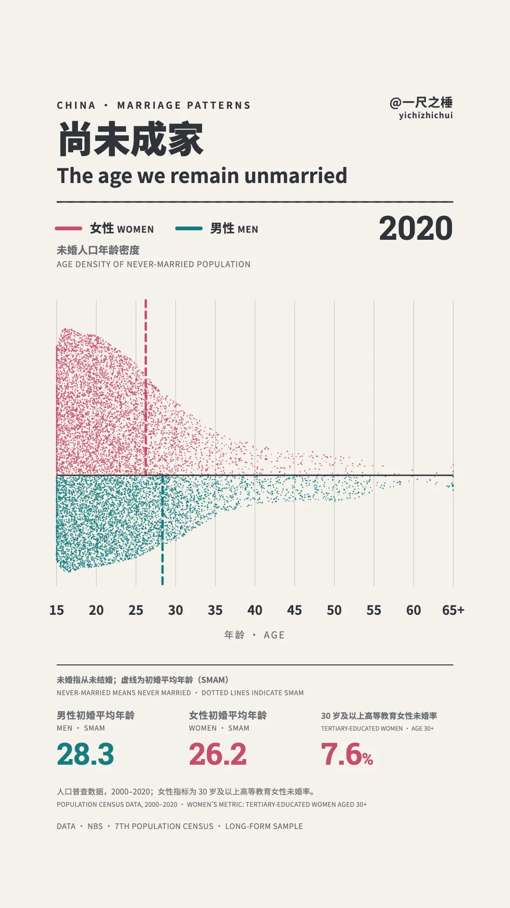 | 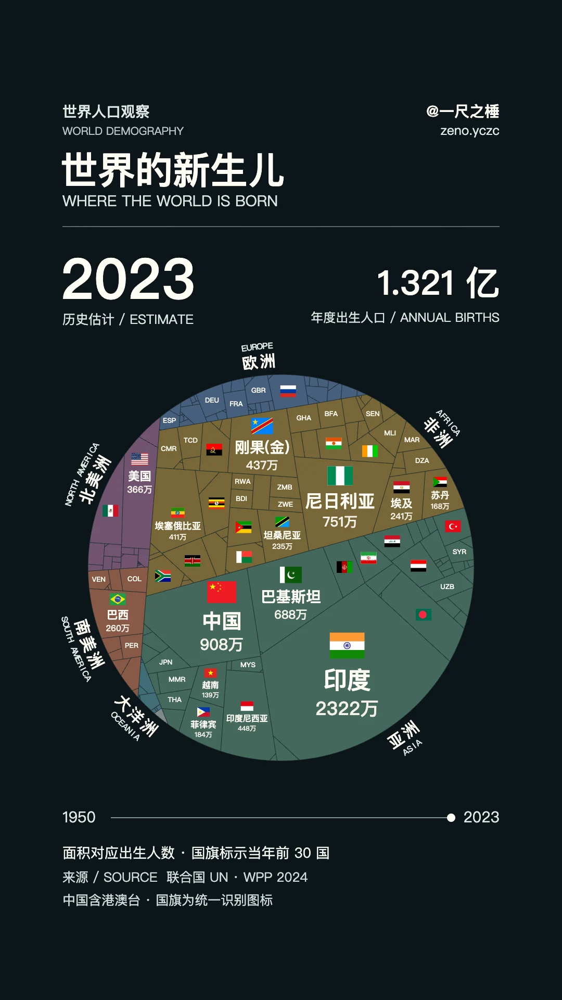 | 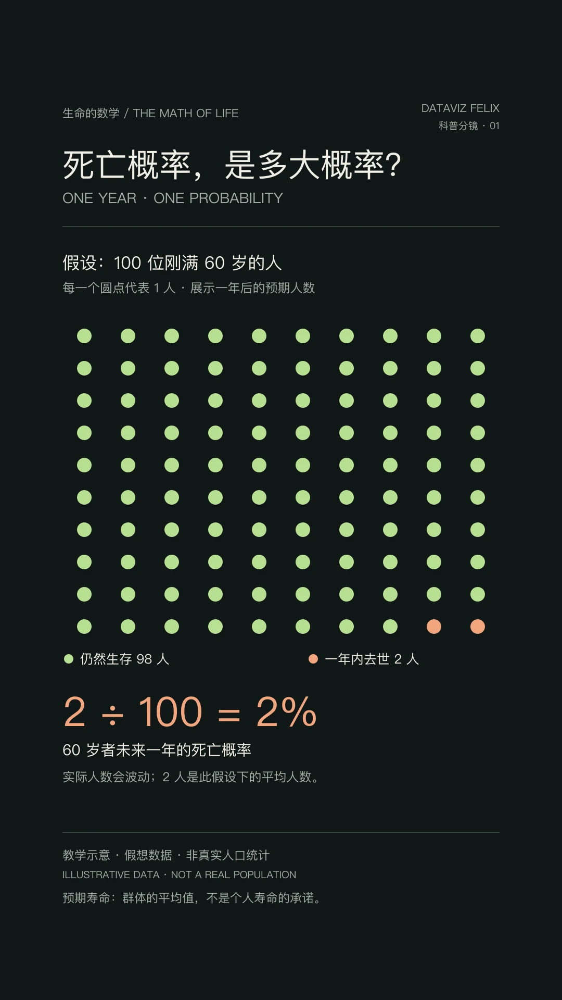 | 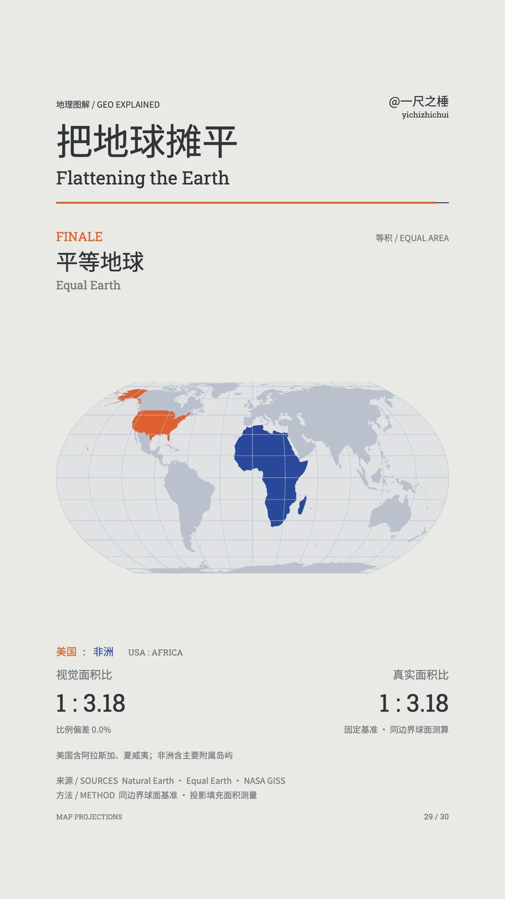 | 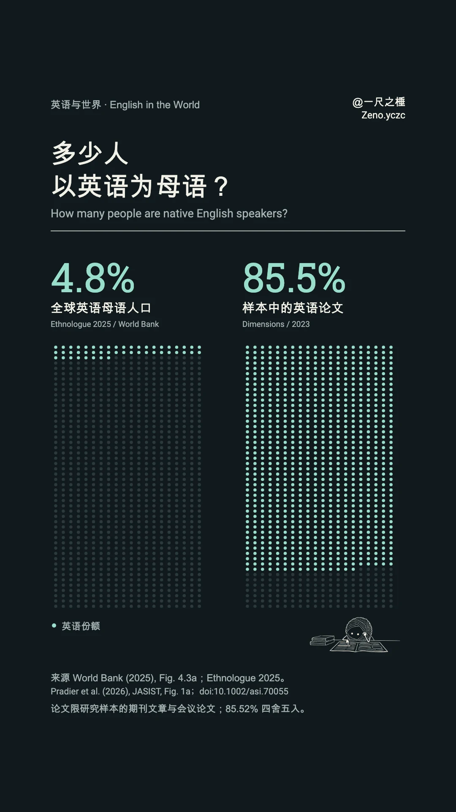 | 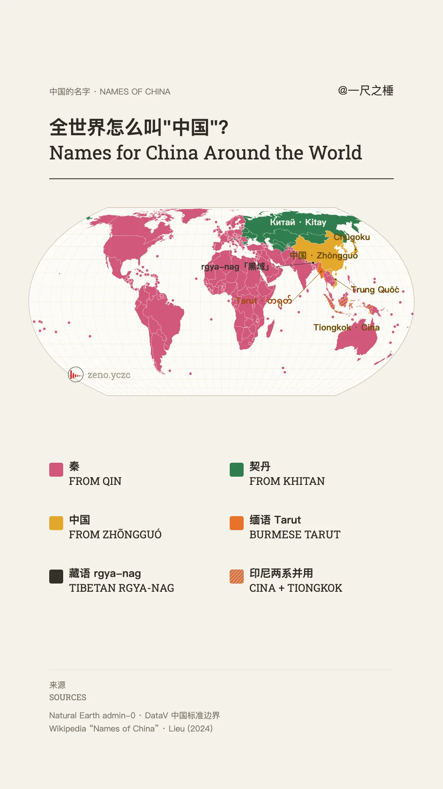 |

### Animation stills, algorithms and 3D concepts

| Moon calendar 2026 | Taiwan coastal lights | Shanghai shortest path | Particle morph | Daguanyuan (WebGPU) |
|---|---|---|---|---|
| 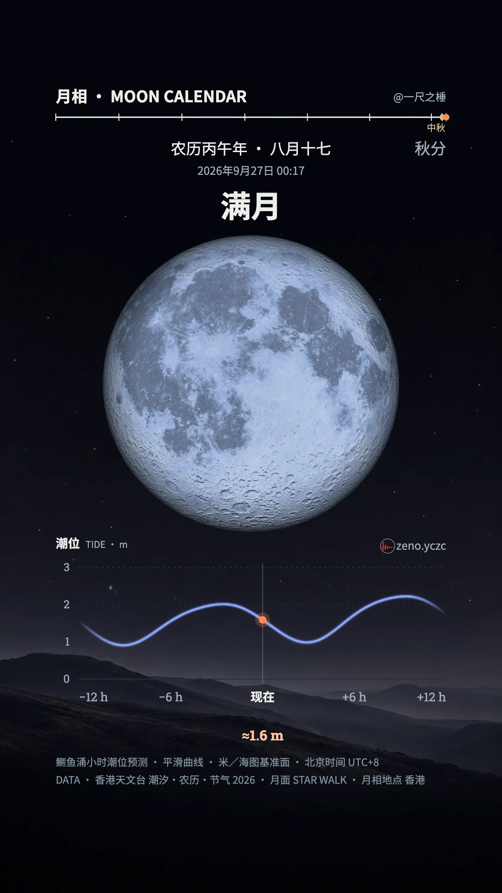 | 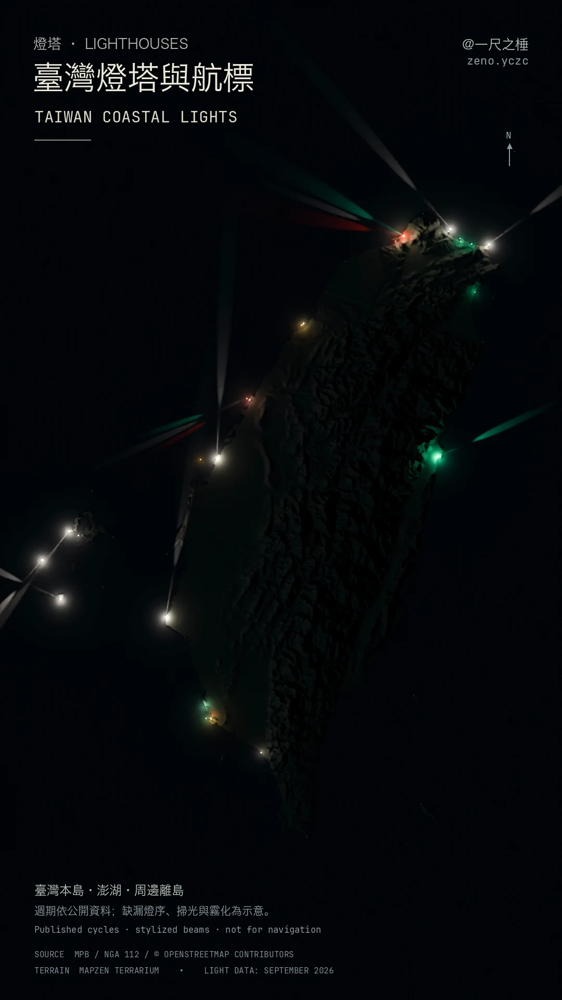 | 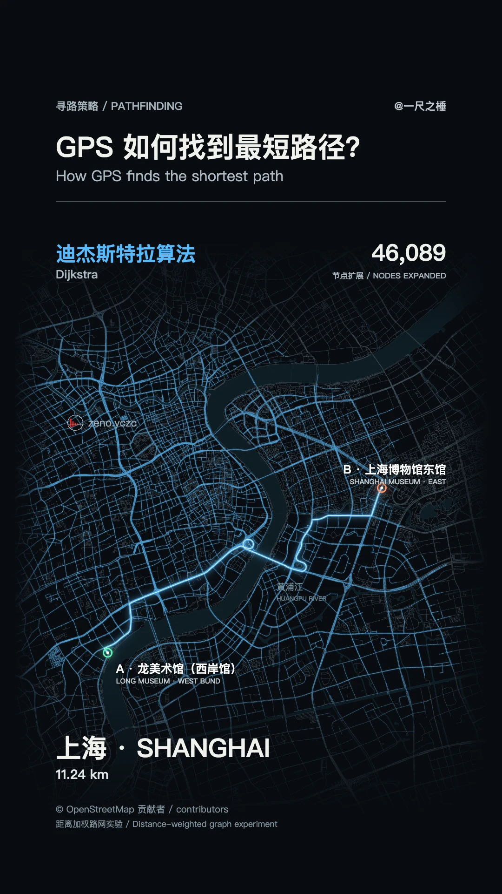 |  |  |

The full file list is in [PUBLIC_WORKS_MANIFEST.md](PUBLIC_WORKS_MANIFEST.md).

## Data-visualization capabilities

### Data sources

| Domain | Sources | Used in |
|---|---|---|
| Built environment | CMAB v7 (GAIA-derived impervious-surface first appearance) | City built-space timelines |
| Population | Kontur Population 2023 (H3 res-8, ~400 m); China population censuses 2000 / 2010 / 2020; UN World Population Prospects 2024 | Population H3 fields, Yangtze / Taiwan density, marriage census, world births |
| Terrain & land cover | Mapzen Terrarium elevation tiles, SRTM, ESA WorldCover, satellite imagery | Dialect relief, Yangtze, Taiwan, Dalian, Gyirong |
| Hydrology | HydroSHEDS (HydroRIVERS, HydroBASINS); Taiwan WRA river-management units | Yangtze and western-Taiwan hydrology |
| Atmosphere & night | FY-4A Lightning Mapping Imager; VIIRS Nighttime Lights (VNL) 2024; NASA Blue Marble; Meteostat | Lightning season, East Asia night lights, Shanghai temperature |
| Boundaries & networks | GADM, Natural Earth, OpenStreetMap (Overpass), NGA List of Lights | Base maps, road-network search, lighthouse animations |
| Astronomy | JPL DE421 ephemeris via Skyfield | Moon calendar 2026 |
| Humanities & language | CBDB (China Biographical Database), open dialect datasets, historical chronologies, World Bank / Ethnologue language statistics | Tang poets network, dialect relief, border history, English in the world |

### Methods

- **Cartography** — equal-area projections by default (Albers on GRS80 for China, Equal Earth for the world); explicit projection contracts so raster bases and vector/column layers align.
- **Spatial aggregation** — native H3 hexagon grids (no resampling or KDE smoothing), equal-area event gridding (e.g. 8 km cells for lightning), catchment and county-level profiles.
- **Relief & 3D** — DEM hillshade compositing with hue-preserving thematic layers; Blender Cycles scenes for terrain, population columns, night lights and coastal light animations; Three.js WebGPU procedural scenes.
- **Motion** — deterministic Canvas particle systems, pre-rendered WebP frame sequences, seek-safe timelines, H.264 export via FFmpeg.
- **Algorithms as visuals** — Dijkstra, A*, bidirectional and greedy search replayed on real OpenStreetMap road graphs (NetworkX), with real event order rather than simulated progress.
- **Explainers** — constructed, clearly labelled illustrative data for concepts such as mortality probability and life-expectancy area.

### Toolchain

Python (GeoPandas, rasterio, pyproj, h3, NetworkX, Pillow, matplotlib) · Node.js (sharp, Playwright) · d3-geo · HTML Canvas · Three.js / WebGPU · Blender (Cycles) · FFmpeg

### Verification practice

- Every GIS input is checked for license, CRS, feature/pixel count, fields, value distribution, spatial coverage and time semantics before rendering.
- Source manifests record versions and SHA-256 hashes; frozen visual contracts lock palette, projection, camera and typography for released series.
- Outputs are verified by `ffprobe`, full decoding and decoded-frame inspection for cropping, collisions, blank frames and map alignment.
- Semantics are stated honestly: proxies are not labelled as official statistics, modelled periods are marked, and a camera-window sum is never presented as a city's official population.

## Repository scope

- Published here: finished images under `public-works/`, this README, the manifest and [`CLAUDE.md`](CLAUDE.md).
- Kept local: renderers, research notes, contracts, raw third-party data, Blender scenes, frames and videos. The root `.gitignore` is an allow-list, so nothing else is committed unless explicitly added.
- Images added in the 2026-09 update are WebP web copies of the local finals; earlier images are unchanged originals.

## Map and data disclosure

Some national maps include the nine-dash line as display geometry only; it contributes no area, particles or statistics, and is not a publication-cleared official map asset. Third-party data, map layers, fonts and imagery remain under their original licenses and attribution requirements.
